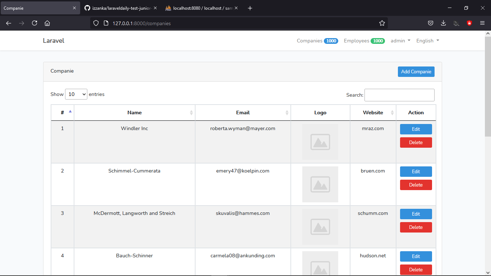
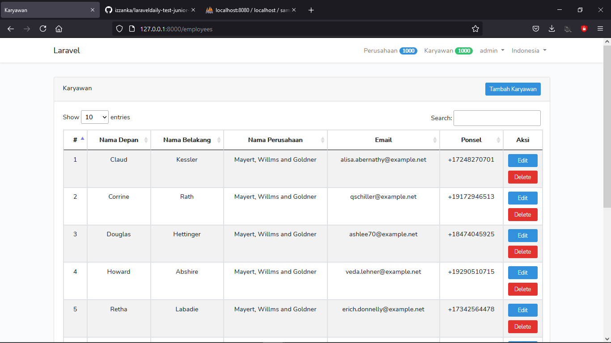
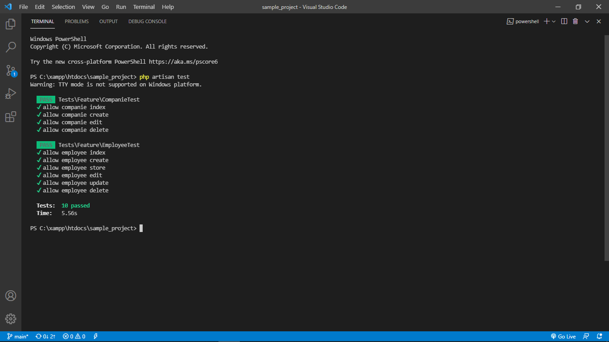

## Link 

https://laraveldaily.com/test-junior-laravel-developer-sample-project/

## Basic Test

- Basic Laravel Auth: ability to log in as administrator √
- Use database seeds to create first user with email admin@admin.com and password       “password” √
- CRUD functionality (Create / Read / Update / Delete) for two menu items: Companies and Employees √
- Companies DB table consists of these fields: Name (required), email, logo (minimum 100×100), website √
- Employees DB table consists of these fields: First name (required), last name (required), Company (foreign key to Companies), email, phone √
- Use database migrations to create those schemas above √
- Store companies logos in storage/app/public folder and make them accessible from public √
- Use basic Laravel resource controllers with default methods – index, create, store etc √
- Use Laravel’s validation function, using Request classes √
- Use Laravel’s pagination for showing Companies/Employees list, 10 entries per page √
- Use Laravel make:auth as default Bootstrap-based design theme, but remove ability to register √

## Advanced Test

- Use Datatables.net library to show table – with our without server-side rendering √
- Use more complicated front-end theme like AdminLTE √
- Email notification: send email whenever new company is entered (use Mailgun or    Mailtrap) √
- Make the project multi-language (using resources/lang folder) √
- Basic testing with phpunit (I know some would argue it should be the basics, but I disagree) √

## Preview

    
    
    

